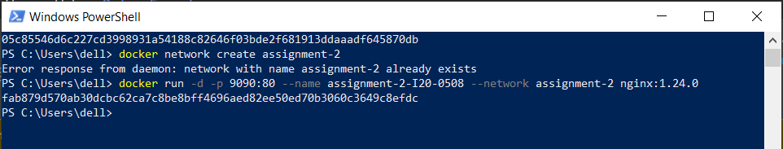
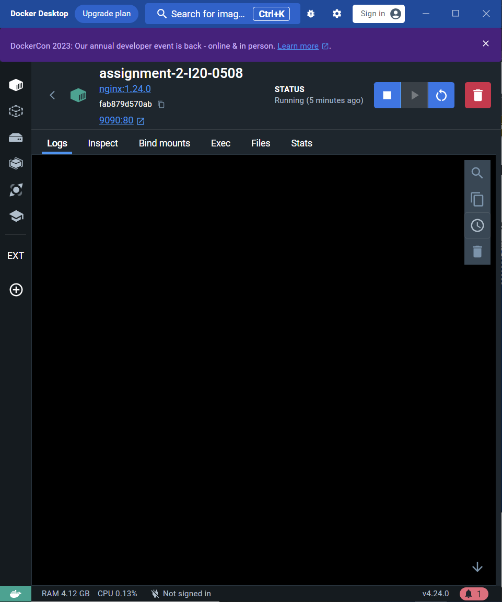
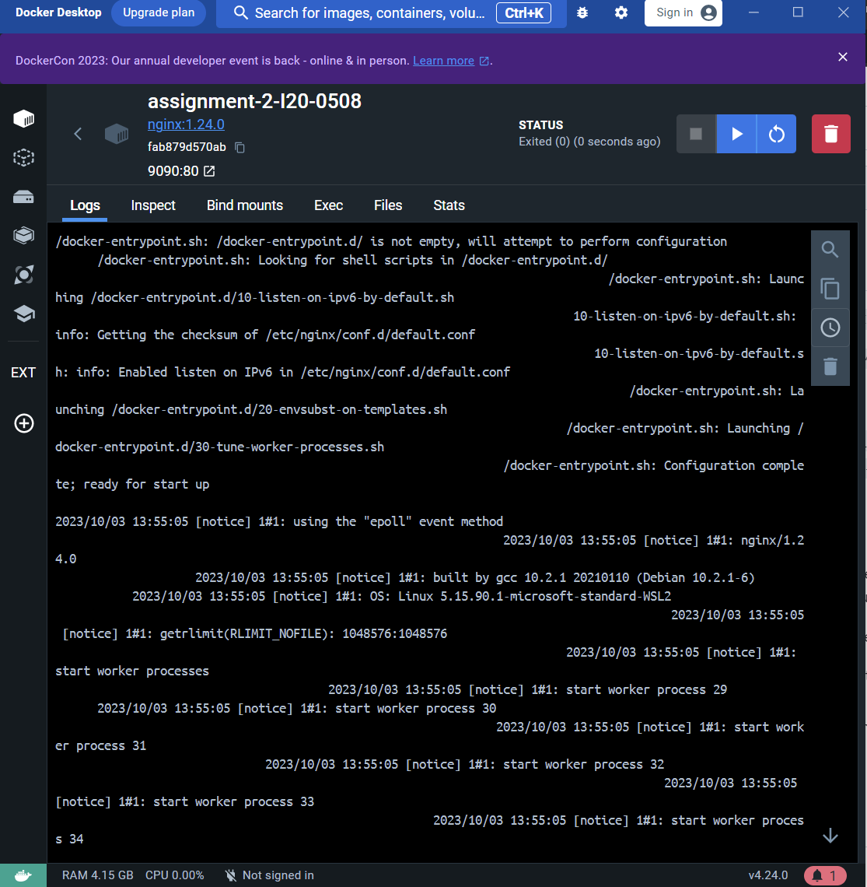

Q1) Explain Docker Containers vs VMs.
Ans) VMs operate at the hardware level, abstracting physical hardware to create isolated environments, each with its own full operating system, applications, and libraries. They can be resource-intensive, taking up tens of gigabytes and are suitable for static workloads. VMs provide strong isolation between VMs but not necessarily between applications within a VM, leading to compatibility challenges between development and operations teams.

On the other hand, containers are based on OS-level virtualization, abstracting at the application layer, including code and dependencies. They share the host OS kernel, making them lightweight and efficient, typically only consuming tens to hundreds of megabytes. Containers offer robust isolation at the application level, ensuring that applications remain isolated from each other. They are well-suited for dynamic workloads and eliminate the "works on my machine" issue by allowing developers to create, test, and deploy applications in consistent environments. However, container security is process-level and may require additional measures for complete isolation compared to VMs. Ops focus on creating VMs and installing container runtimes like Docker, while developers work with containers based on the same image throughout the development lifecycle.

Q2) Write command to create a docker container in detached mode with name assignment-2-<ROLL_NUMBER> running on host port 9090 and container port 80 using image nginx with version 1.24.0 on a custom network named assignment-2
Ans) 

1. docker network create assignment-2

2. docker run -d -p 9090:80 --name assignment-2-I20-0508 --network assignment-2 nginx:1.24.0

Q3) Run the above command and add screenshot of it and share the logs

