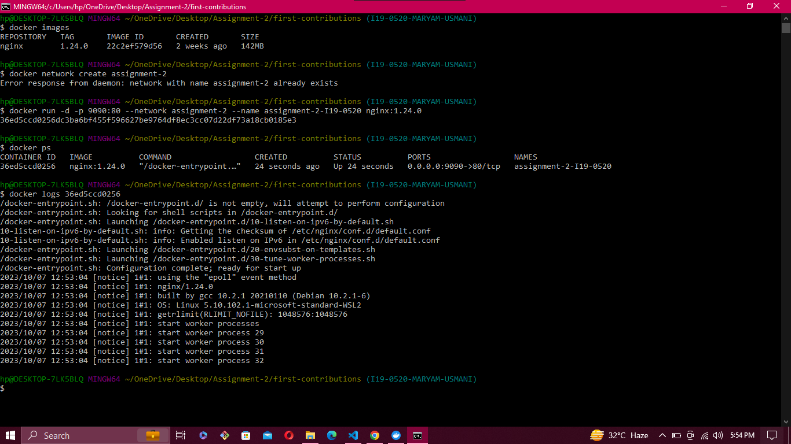

# Q1) Explain Docker Containers vs VMs
# Ans)
1. Docker Containers are OS level virtualization (they share Host OS Kernel) while VMs are hardware based virtualization.
2. Containers have burstable memory, burstable compute, is isolated and have low resource usage while on the other hand, VMs have static memory, static compute and high resource usage.
3. Container shares host's OS kernel while VM has a complete OS with binaries and libraries that is why it takes more space than containers.

# Q2) Write command to create a docker container in detached mode with name assignment-2-<ROLL_NUMBER> running on host port 9090 and container port 80 using image nginx with version 1.24.0 on a custom network named assignment-2
# Ans)
container run -d -p 9090:80 --name assignment-2-I20-0569 --network assignment-2 nginx:1.24.0

# Q3) Run the above command and add screenshot of it and share the logs
