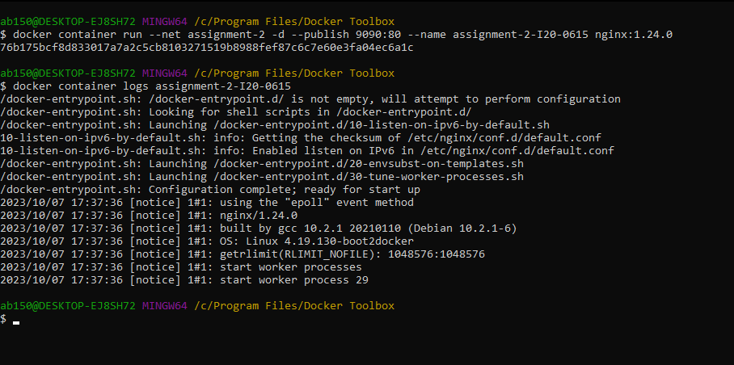

Q1:
Docker Containers:
OS level virtualization, share hardware can have own OS. Smaller in size upto 10s to 100s of MBs and faster boot.

VMs:
Hardware level virtualization, has a copy of OS, multiple applications, binaries. Larger in size upto 10s of GBs and slow to boot

Q2:
docker container run --net assignment-2 -d --publish 9090:80 --name assignment-2-I20-0615 nginx:1.24.0

Q3:
