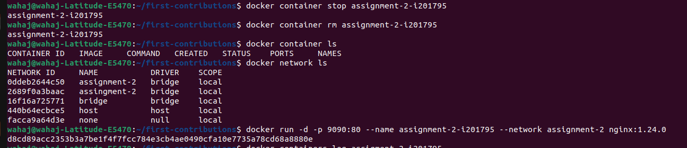

Q1)
Docker Containers:

Lightweight and efficient.
Share the host OS kernel.
Highly portable.
Ideal for microservices.
Faster startup and lower resource usage.
Managed with Docker tools.
Virtual Machines (VMs):

Heavier and resource-intensive.
Run their own OS kernel.
Less portable due to full OS.
Better for monolithic apps.
Stronger isolation.
Managed with hypervisor tools.

Choose Docker containers for agility and efficiency, VMs for strong isolation and compatibility with legacy applications.

Q2)
docker network create assignment-2
docker run -d -p 9090:80 --network assignment-2 --name assignment-2-I20-0702 nginx:1.24.0

Q3)
   

