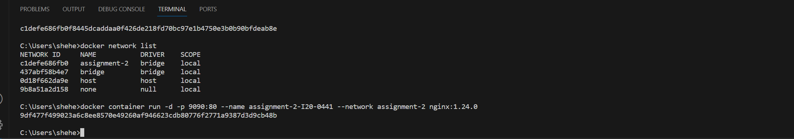
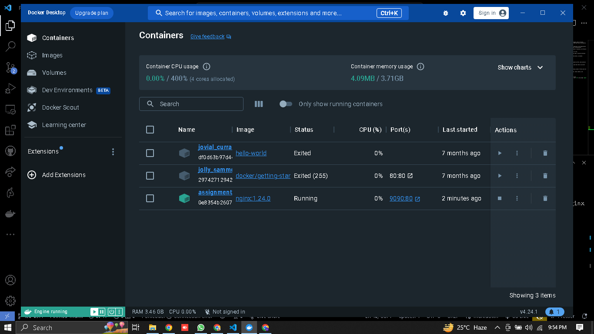

Q1) Explain Docker Containers vs VMs

Answer: Although both containers and virtual machines (VMs) are technologies used to execute applications, their operations are separate from one another and they each have their own benefits.

Containers:

1. Abstraction Level: Containers offer OS-level virtualization, which abstracts at the application layer—which includes the code and its dependencies—and provides OS-level virtualization.

2. Resource Sharing: They can use their own light-weight operating system if necessary, but they do share hardware resources and the kernel of the host operating system.

3. Size: Containers are often only a few tens to hundreds of gigabytes in size.

4. Isolation: Containers are segregated from one another, which enables them to execute different programmes.

5. Key Features: Key characteristics include resource efficiency, shared kernel, burstable computation, burstable memory, and container separation.

VMs (Virtual Machines):

1. Abstraction Level: Virtualization at the hardware level is made possible by VMs, which abstract physical hardware resources.

2. Sharing of resources: Although VMs can use the same hardware, they each have their own entire copies of the operating system, application, binaries, and libraries.

3. Size: A single virtual machine might occupy tens of gigabytes.

4. Isolation: While VMs are separated from one another, programmes running inside of them could not be.

5. Key Features: Important characteristics: full OS, static computation, static memory, and significant resource consumption.

Q2) Write command to create a docker container in `detached` mode with name `assignment-2-<ROLL_NUMBER>` running on host port `9090` and container port `80` using image `nginx` with version `1.24.0` on a custom network named `assignment-2`

