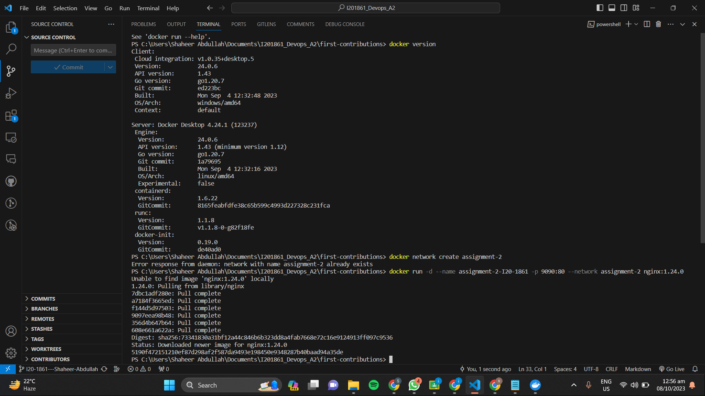
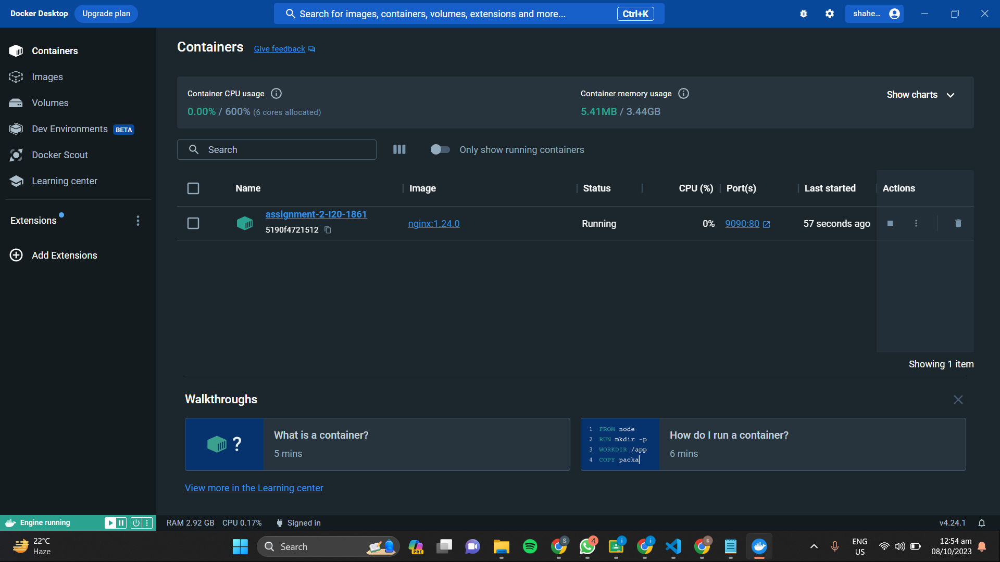

Q1 Explain Docker Containers vs VMs

Containers:

1.Abstraction Level: Containers are like individual apps with all their stuff bundled together. They focus on the app and its needs.

2.Sharing Resources: Containers are like sharing a computer with others, but they all use the same computer engine and can bring their own extra tools if needed.

3.Size: Containers are usually small, like tiny app packages.

4.Isolation: Each container is like a separate room they don't interfere with each other so different apps can run without problems.

5.Key Features: Containers are good at using resources efficiently, sharing the kernel and can quickly use more resources when needed.

6.Security: Containers are less secure then Vms as they share the kernal of host os.

Virtual Machines (VMs):

1.Abstraction Level: VMs are like whole computers inside your computer.They pretend to be real computers and have separate kernal.

2.Sharing Resources: VMs have their own complete computer setup, including an operating system. It's like having many full computers on one machine.

3.Size: Each VM can be pretty big, like having multiple full computers on your computer.

4.Isolation: VMs are like separate houses; they have their own everything, but they don't play well together.

5.Key Features: VMs have their full operating systems, and they use a fixed amount of resources. They can be resource-hungry because they act like real computers.

6.Security: VMs are more secure as they have separate kernal and don't share the kernal of host os.

Q2 Write command to create a docker container in detached mode with name assignment-2-<ROLL_NUMBER> running on host port 9090 and container port 80 using image nginx with version 1.24.0 on a custom network named assignment-2

docker network create assignment-2
docker run -d --name assignment-2-I20-1861 -p 9090:80 --network assignment-2 nginx:1.24.0

Q3 Run the above command and add screenshot of it and share the logs

