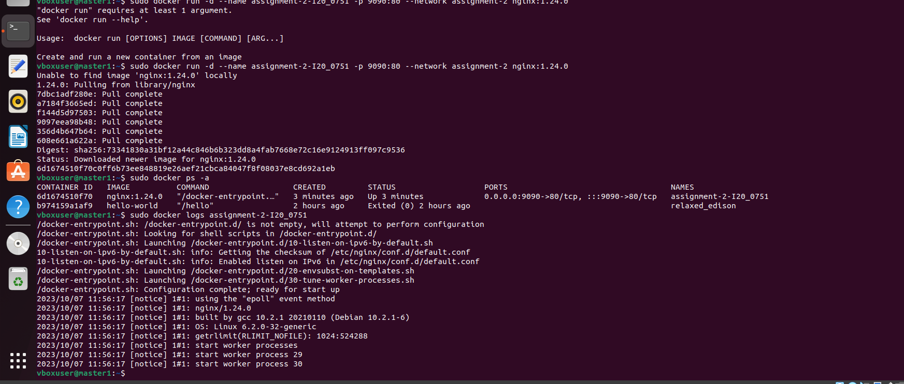
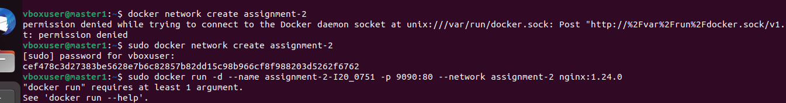

# Raffay Arshad  20I-0751
## Assignment # 2 - Task 2

Q1) Explain Docker Containers vs VMs

The fundamental differences between Docker Containers and Virtual Machines (VMs) lie in their approaches to virtualization. 
Containers operate at the OS level, isolating applications and packaging them with dependencies, resulting in lightweight, efficient, and fast-to-boot instances. 
In contrast, VMs function at the hardware level, abstracting physical resources to create multiple independent servers, each with its own OS, making them resource-intensive and slower to start. 
Containers share hardware and the host OS kernel, allowing for flexibility in resource usage, while VMs have isolated hardware and OS, contributing to their security and isolation advantages. 
However, this isolation also renders VMs heavier and less agile. Ultimately, the choice between Containers and VMs hinges on specific use cases, with Containers excelling in rapid deployment and resource efficiency, while VMs offer enhanced security and isolation.

Q2) Write command to create a docker container in detached mode with name assignment-2-<ROLL_NUMBER> running on host port 9090 and container port 80 using image nginx with version 1.24.0 on a custom network named assignment-2
Ans) 
In order to make the network: docker network create assignment-2
For creating the Docker Container: sudo docker run -d --name assignment-2-I20_0751 -p 9090:80 --network assignment-2 nginx:1.24.0

Q3) Run the above command and add screenshot of it and share the logs

............Screenshot attached in the folder
............Screenshot attached in the folder

