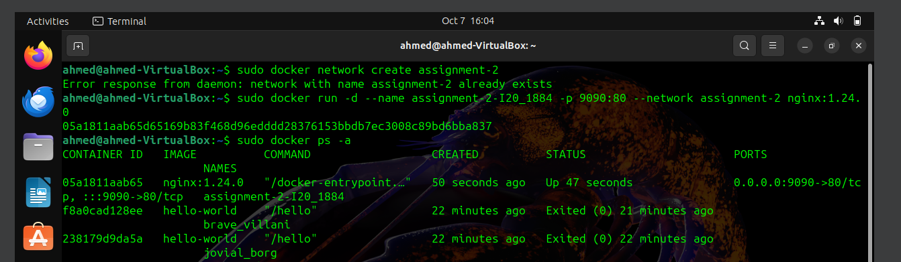
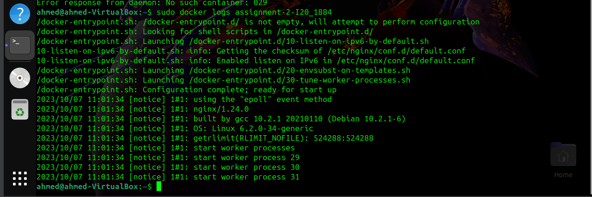

Q1) Explain Docker Containers vs VMs
Docker Containers:

Docker operates at the application layer, abstracting code and dependencies into lightweight, portable units. Sharing the host OS kernel, containers are compact (tens to hundreds of MBs) and offer burstable compute and memory. With Ops handling Docker setup, developers write and test code consistently across environments, eliminating the "works on my machine" issue. The same container image deployed in staging and production ensures seamless consistency and scalability for modern software.

Virtual Machines (VMs):

VMs work at the hardware level, creating complete, isolated environments with their own OS, applications, and libraries. Though secure, VMs are resource-intensive (tens of GBs) and have static compute and memory. Ops handle VM creation and software installations, often leading to compatibility challenges. These differences in environments can result in the "works on my machine" problem, causing discrepancies between developer setups and operational configurations.

Q2) Write command to create a docker container in `detached` mode with name `assignment-2-<ROLL_NUMBER>` running on host port `9090` and container port `80` using image `nginx` with version `1.24.0` on a custom network named `assignment-2`

For making the network: sudo docker network create assignment-2
For creating docker container: sudo docker run -d --name assignment-2-I20_1884 -p 9090:80 --network assignment-2 nginx:1.24.0

Q3) Run the above command and add screenshot of it and share the logs

