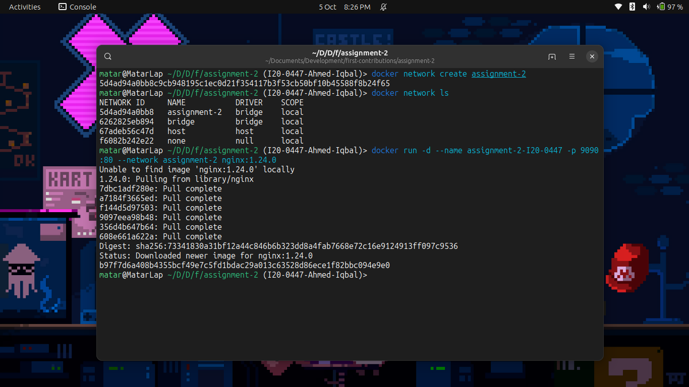
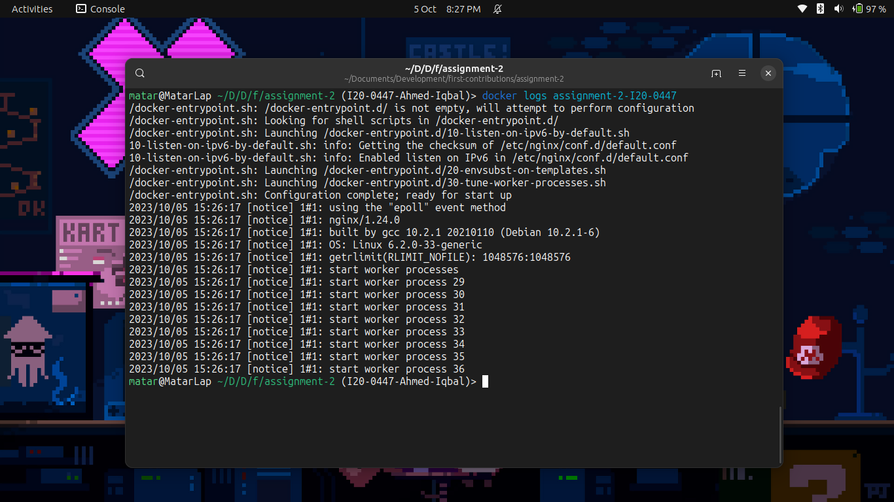

### Q1. Explain Docker Containers vs VMs

There are 3 main differences between docker containers and virtual machines.

1. Docker containers share the host OS kernel, leading to lightweight deployment and faster startup times.
2. VMs have higher resource overhead due to running complete guest OSes with separate kernels.
3. Containers provide application-level isolation, while VMs offer stronger hardware-level isolation for strict security requirements.

### Q2. Write command to create a docker container in `detached` mode with name `assignment-2-<ROLL_NUMBER>` running on host port `9090` and container port `80` using image `nginx` with version `1.24.0` on a custom network named `assignment-2`

```
docker run -d --name assignment-2-I20-0447 -p 9090:80 --network assignment-2 nginx:1.24.0
```

If the network `assignment-2` does not already exist then Docker will create it automatically. However, if we want to create it beforehand and list available networks then we can use the following commands.

```
docker network create assignment-2
docker network ls
```

### Q3. Run the above command and add screenshot of it and share the logs



