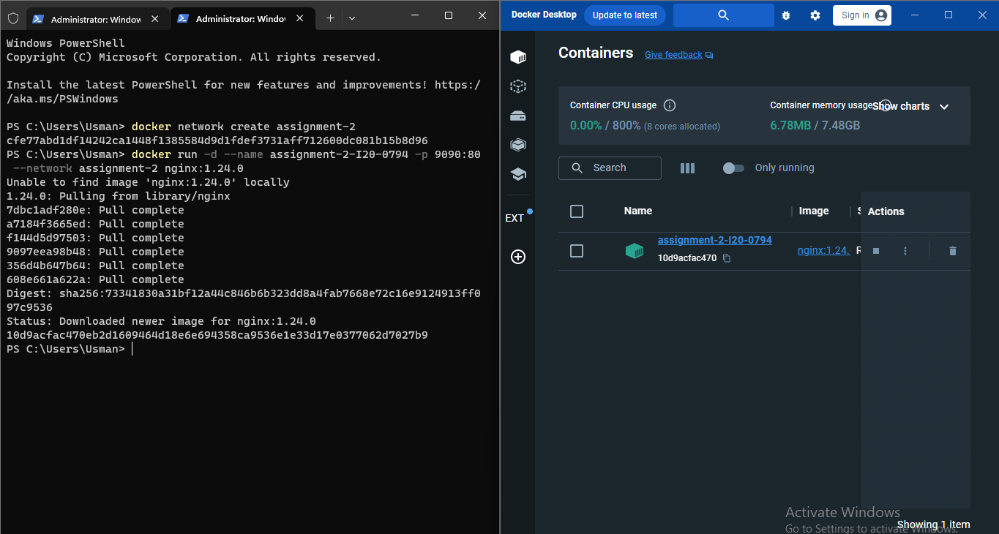
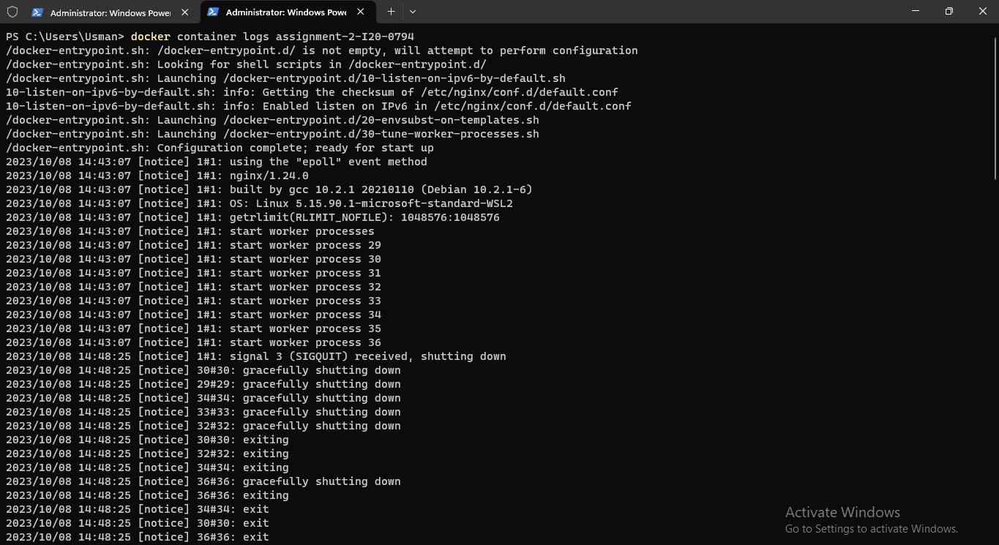

# Assignment 2

### Q1) Explain Docker Containers vs VMs.
| Feature               | Docker Containers                              | Virtual Machines (VMs)                            |
|-----------------------|----------------------------------------------- |------------------------------------------------   |
| **Weight**            | Lightweight: Only the app and its dependencies | Full OS: Each VM runs a full OS instance          |
| **OS**                | Shared OS: All containers share the same kernel| Isolated: Complete isolation from host & other VMs|
| **Startup Time**      | Fast: Starts almost instantly                  | Slower: Takes time to boot up the entire OS       |
| **Efficiency**        | High: Minimal overhead, less space & resources | Resource Intensive: Requires more system resources|
| **Portability/Size**  | Portable: Consistent across environments       | Larger: App, binaries, libraries, & entire OS     |

---

### Q2) Write command to create a docker container in detached mode with name assignment-2-<ROLL_NUMBER> running on host port 9090 and container port 80 using image nginx with version 1.24.0 on a custom network named assignment-2

#### The commands I used: 
```
docker network create assignment-2

docker run -d --name assignment-2-I20-0794 -p 9090:80 --network assignment-2 nginx:1.24.0
``````
---
### Q3) Run the above command and add screenshot of it and share the logs.

#### Running the container:



#### Logs:

---