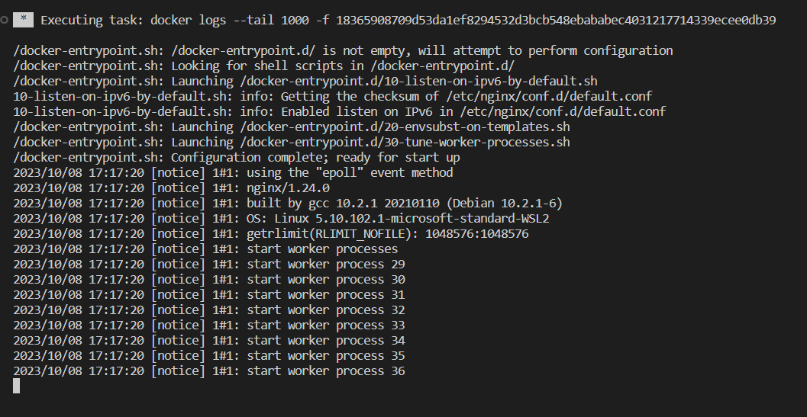

Q1.
Containers are processes on the host OS (usng host OS's kernal) which are isolated from other processes. As a process, they have burstable compute and memory of the host OS and requires resources as per need. So, they share the libraries of it's host OS.
While VMs have hardware level virtualization using hyperviser, having static memory and compute resources. They share hardware, and have their own OS. VM's require manual installation of libraries, apps and all other dependencies.

Since VM's interact directly with hardware, so they are pretty secure just like any other OS. Container's are also secure as thery are isolated on OS level from other processes, but they can be tempered by tampering with host OS's kernal.

Q2.
sudo docker run -d --rm --name assignment-2-I19-0611 -p 9090:80 --network assignment-2 nginx:1.24.0
//removing container after it is stopped

Q3.
