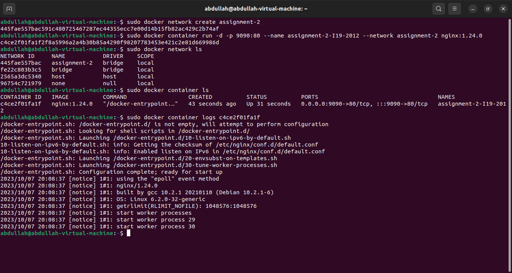

# Abdullah Shahzad `19I-2012`
## DevOps Assignment#02 

### Q1) Explain Docker Containers vs VMs
VMs are an abstraction of physical hardware turning one server into multiple servers while containers are an abstraction at the application layer that packages code and dependencies together. VMs run on a hypervisor, which is a software or hardware layer that creates and manages multiple VMs on a physical server while containers share the host OS's kernel but run in isolated user spaces. 

VMs come with more overhead because each VM includes a full OS, which can consume a significant amount of resources. On the other hand, containers are lightweight because they don't need a full OS for each application as they share the host OS kernel and use resources more efficiently. VMs provide strong isolation since each VM has its own OS, and they operate independently of each other. Containers provide isolation, but it's not as strong as VMs. They share the same OS kernel, which means they are more lightweight but also more interdependent.

In a nutshell, VMs are like running multiple computers on a single physical machine, each with its own OS, while containers are like running multiple applications in lightweight, isolated environments that share the same OS kernel.

### Q2) Write command to create a docker container in `detached` mode with name `assignment-2-<ROLL_NUMBER>` running on host port `9090` and container port `80` using image `nginx` with version `1.24.0` on a custom network named `assignment-2`
First create a network name `assignment-2`
```
docker network create assignment-2
```
Now create the docker container named `assignment-2-I19-2012` on the custom network
```
docker container run -d -p 9090:80 --name assignment-2-I19-2012 --network assignment-2 nginx:1.24.0
```

### Q3) Run the above command and add screenshot of it and share the logs

