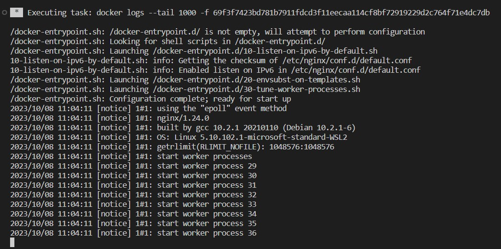

Ans1: Containers are more of a resource efficient as they share the host OS. This in turn, leads to a lighter and protable container using less resources, allowing for faster startup and scaling of applications. While virtual machines include a complete OS, consuming resources like CPU, memory. VMs tend to be heavier on resource usage due to the overhead of running multiple guest OS instances. 
The second difference is the way how data is managed in both of them. Containers do not inherently provide persistent data storage but by using disk mounting or volume to have some sort of persistent storage. On the other hand, VMs have proper dedicated memory for data storage.
The last difference is that VMs offer strong isolation with separate guest OS instances, crucial for security but resource-intensive. While containers share the host OS kernel, providing lower isolation, suitable for shared environments but not ideal for sensitive or multi-tenant workloads.
Ans2:
docker network create assignment-2
docker run -d --name assignment-2-I20-0445 -p 9090:80 --network assignment-2 nginx:1.24.0     
Ans3:
