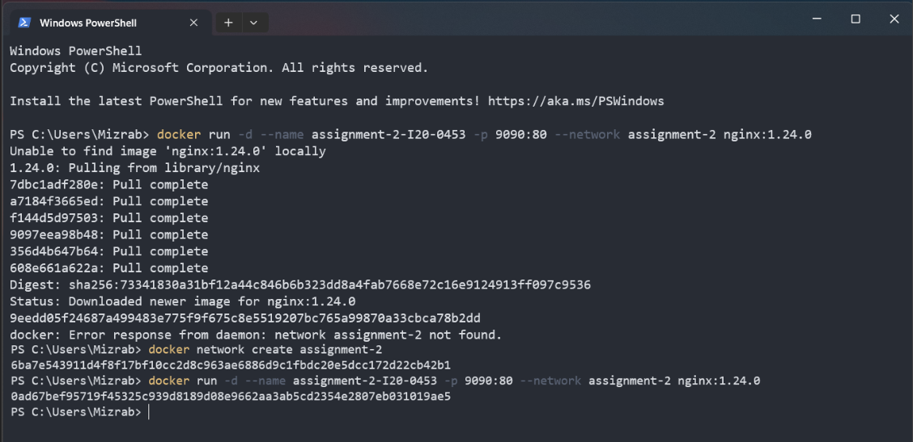
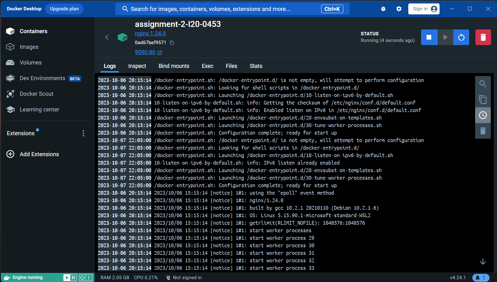

### Q1) Explain Docker Containers vs VMs

- **Docker Containers:** Containers are lightweight, isolated environments that share the host OS kernel. They package applications and their dependencies, making them highly efficient in terms of resource utilization.

- **Virtual Machines (VMs):** VMs are complete virtualized operating systems that run on a hypervisor. They are heavier as they include an entire OS for each instance, which can consume more resources.

### Q2) Write command to create a docker container in `detached` mode with name `assignment-2-<ROLL_NUMBER>` running on host port `9090` and container port `80` using image `nginx` with version `1.24.0` on a custom network named `assignment-2`

Command would be:

docker run -d --name assignment-2-I20-0453 -p 9090:80 --network assignment-2 nginx:1.24.0

Screenshot:

 *Since we are running in detached mode, the terminal is free to use for any other purposes.

