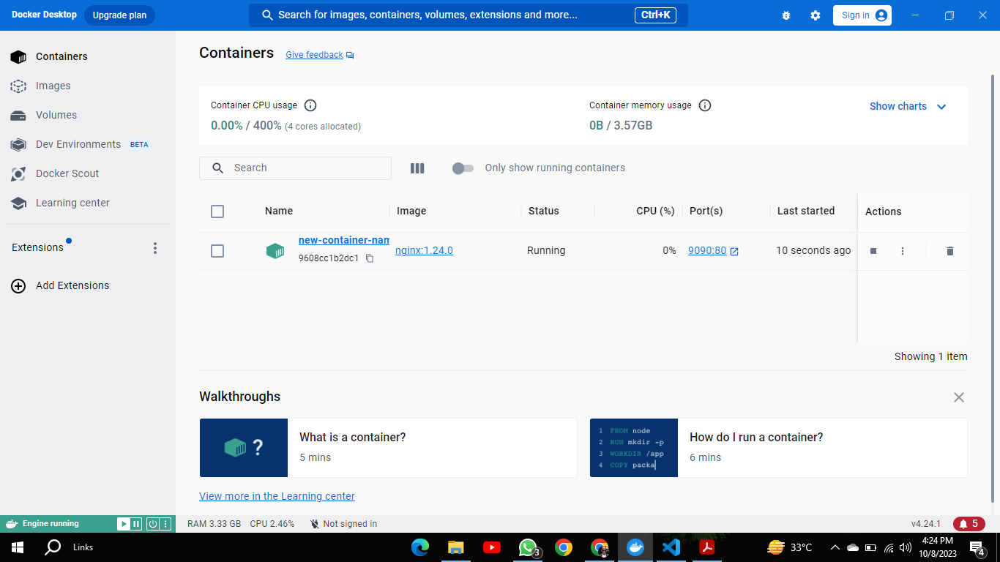

- Question 1: Docker Containers vs VM
# Docker Containers are Software level Virtualizaation while VMs are hardware lvel virtualization.
# Docker Containers share existing infrastructure of Host while VMs have thier own Infrastructre/OS etc.
# Docker Containers have weak Isolation while VMs have strong Isolation.
# Docker Containers bring their dependencies with them while VMs have to get them installed separately.

- Question 2:  Write command to create a docker container in `detached` mode with name `assignment-2-<ROLL_NUMBER>` running on host port `9090` and container port `80` using image `nginx` with version `1.24.0` on a custom network named `assignment-2`

# docker run -d --name assignment-2-I20-0526 -p 9090:80 --network assignment-2 nginx:1.24.0

- Question 3:  

# Screenshot is attatched and Logs are given below

2023-10-08 16:24:35 /docker-entrypoint.sh: /docker-entrypoint.d/ is not empty, will attempt to perform configuration
2023-10-08 16:24:35 /docker-entrypoint.sh: Looking for shell scripts in /docker-entrypoint.d/
2023-10-08 16:24:35 /docker-entrypoint.sh: Launching /docker-entrypoint.d/10-listen-on-ipv6-by-default.sh
2023-10-08 16:24:35 10-listen-on-ipv6-by-default.sh: info: Getting the checksum of /etc/nginx/conf.d/default.conf
2023-10-08 16:24:35 10-listen-on-ipv6-by-default.sh: info: Enabled listen on IPv6 in /etc/nginx/conf.d/default.conf
2023-10-08 16:24:35 /docker-entrypoint.sh: Launching /docker-entrypoint.d/20-envsubst-on-templates.sh
2023-10-08 16:24:35 /docker-entrypoint.sh: Launching /docker-entrypoint.d/30-tune-worker-processes.sh
2023-10-08 16:24:35 /docker-entrypoint.sh: Configuration complete; ready for start up
2023-10-08 16:24:35 2023/10/08 11:24:35 [notice] 1#1: using the "epoll" event method
2023-10-08 16:24:35 2023/10/08 11:24:35 [notice] 1#1: nginx/1.24.0
2023-10-08 16:24:35 2023/10/08 11:24:35 [notice] 1#1: built by gcc 10.2.1 20210110 (Debian 10.2.1-6) 
2023-10-08 16:24:35 2023/10/08 11:24:35 [notice] 1#1: OS: Linux 5.15.90.1-microsoft-standard-WSL2
2023-10-08 16:24:35 2023/10/08 11:24:35 [notice] 1#1: getrlimit(RLIMIT_NOFILE): 1048576:1048576
2023-10-08 16:24:35 2023/10/08 11:24:35 [notice] 1#1: start worker processes
2023-10-08 16:24:35 2023/10/08 11:24:35 [notice] 1#1: start worker process 29
2023-10-08 16:24:35 2023/10/08 11:24:35 [notice] 1#1: start worker process 30
2023-10-08 16:24:35 2023/10/08 11:24:35 [notice] 1#1: start worker process 31
2023-10-08 16:24:35 2023/10/08 11:24:35 [notice] 1#1: start worker process 32

