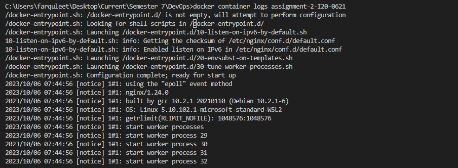

Q1) Explain Docker Containers vs VMs
Docker Container:
1. OS level virtualization
2. Share hardware, host OS kernel but can
have own OS
3. burstable compute and memory
VMs:
1. Hardware level virtualization
2. VM has a full copy of an operating system + application + binaries + libraries
3. static compute and memory

Q2) Write command to create a docker container in detached mode with name assignment-2-<ROLL_NUMBER> running on host port 9090 and container port 80 using image nginx with version 1.24.0 on a custom network named assignment-2

docker container run -d -p  9090:80 --name assignment-2-I20-0621 --network assignment-2 nginx:1.24.0 

Q3) Run the above command and add screenshot of it and share the logs

Create a PR from your branch to this repo i.e. the parent(kahootali/first-contributions) repo main branch with title Assignment 2 - <ROLL_NUMBER> - <FIRST_NAME-LAST_NAME>
In the PR description, mention that this PR will fix the issue number that you created in the above steps. so that the issue gets closed automatically when PR gets merged
Handle any comments on the PR review
Get this PR merged into this parent repo