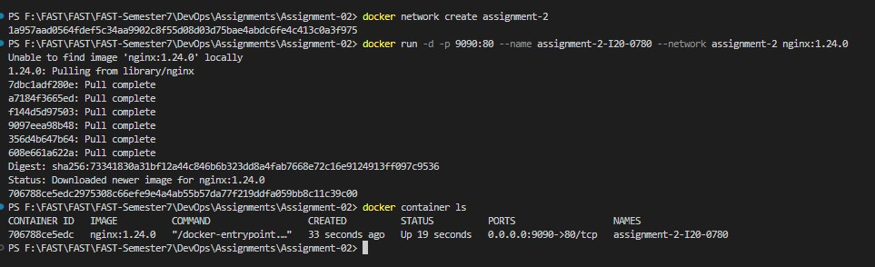
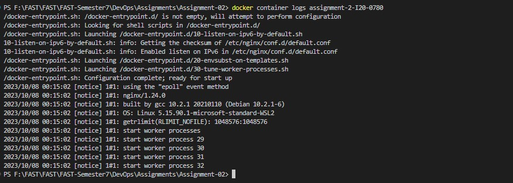

Q1) Explain Docker Containers vs VMs
Ans):
1. A VM provides hardware level virtualization while a docker container provides OS level (code + dependencies) virtualization.
2. A VM (each) has its own OS Kernel while a docker container (each) can either have its own OS Kernel or may share host OS Kernel. 
3. A VM is heavyweight (size in GBs) while a docker container is lightweight (size in MBs).
4. A VM has "works on my machine" issue while a docker container ideally has no "works on my machine" issue
5. A VM is more secure than a docker container as containers have process level isolation.

Q2) Write command to create a docker container in `detached` mode with name `assignment-2-<ROLL_NUMBER>` running on host port `9090` and container port `80` using image `nginx` with version `1.24.0` on a custom network named `assignment-2`
Ans):
docker run -d -p 9090:80 --name assignment-2-I20-0780 --network assignment-2 nginx:1.24.0

Q3) Run the above command and add screenshot of it and share the logs
Ans):

