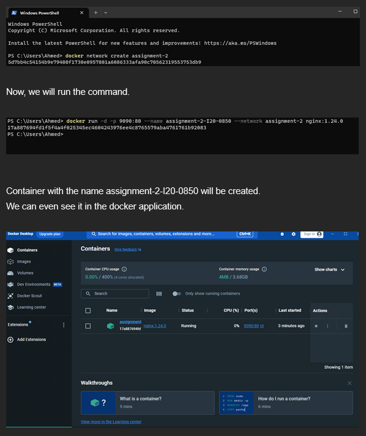
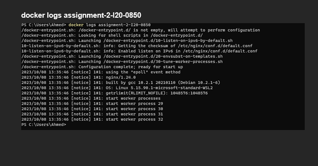

Q1) Explain docker containers vs VMs?

Docker Containers
Although Docker containers are separated from one another, they use the same operating system as the host machine. They just include the particular piece of software and its dependencies. You can operate a lot of containers on a single server without using up a lot of RAM or other resources since containers are so lightweight.
I.e A container is similar to a unique box for each app on your smartphone. Although each program (container) works separately and has its own set of resources, they all use the same smartphone (operating system) as their core.

Virtual Machines
On the other hand, virtual machines function similarly to full-fledged computers within your computer. Like your laptop or desktop, they have their own operating system.
Because they run a whole OS, VMs are larger and consume more resources. As a result, they are less effective in using resources than containers.
Imagine running a number of virtual machines (VMs) on your laptop, each running a separate copy of Windows or Linux. Compared to just running software in containers on your laptop, these VMs use a lot of space and resources.

Q2) Write command to create a docker container in detached mode with name assignment-2-<ROLL_NUMBER> running on host port 9090 and container port 80 using image nginx with version 1.24.0 on a custom network named assignment-2

docker run -d \
  --name assignment-2-I20-0850 \
  --network assignment-2 \
  -p 9090:80 \
  nginx:1.24.0

Q3) Run the above command and add screenshot of it and share the logs
Since, the above command is using the network assignment-2. Therefore, we have to create a network first.
docker network create assignment-2

