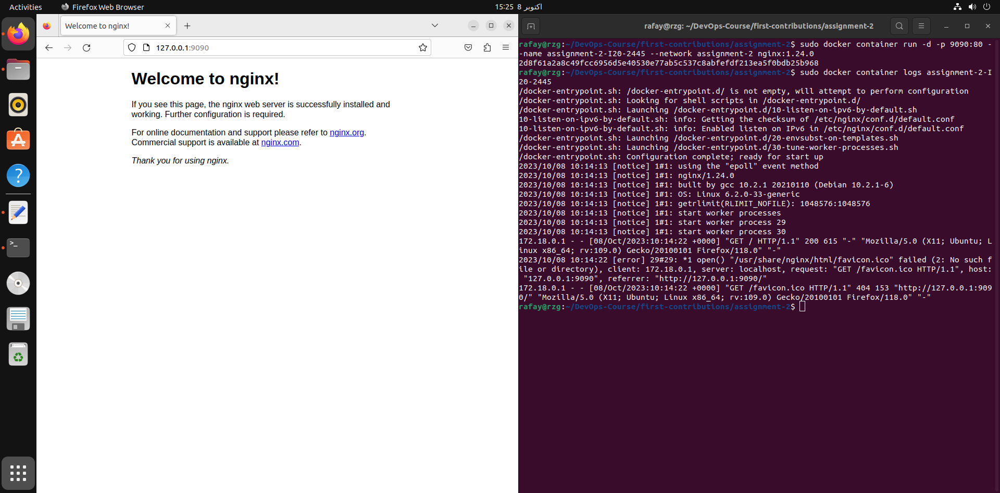

### Q1) Explain Docker Containers vs VMs
1) Docker Containers are the running instances of docker images. Containers support OS level virtualization. OS kernel is shared in this case. Whereas, VMs shave hardware level virtualization. 
2) Containers comes with its own libraries. But in VM we have to install everything in it.
3) Containers are burstable compute. VM is a static compute machine.

### Q2) Write command to create a docker container in `detached` mode with name `assignment-2-<ROLL_NUMBER>` running on host port `9090` and container port `80` using image `nginx` with version `1.24.0` on a custom network named `assignment-2`
Commmand is as following: 
`docker container run -d --name assignment-2-I20-2445 -p 9090:80 --network assignment-2 nginx:1.24.0`

### Q3) Run the above command and add screenshot of it and share the logs



Logs are as following
```
/docker-entrypoint.sh: /docker-entrypoint.d/ is not empty, will attempt to perform configuration
/docker-entrypoint.sh: Looking for shell scripts in /docker-entrypoint.d/
/docker-entrypoint.sh: Launching /docker-entrypoint.d/10-listen-on-ipv6-by-default.sh
10-listen-on-ipv6-by-default.sh: info: Getting the checksum of /etc/nginx/conf.d/default.conf
10-listen-on-ipv6-by-default.sh: info: Enabled listen on IPv6 in /etc/nginx/conf.d/default.conf
/docker-entrypoint.sh: Launching /docker-entrypoint.d/20-envsubst-on-templates.sh
/docker-entrypoint.sh: Launching /docker-entrypoint.d/30-tune-worker-processes.sh
/docker-entrypoint.sh: Configuration complete; ready for start up
2023/10/08 10:14:13 [notice] 1#1: using the "epoll" event method
2023/10/08 10:14:13 [notice] 1#1: nginx/1.24.0
2023/10/08 10:14:13 [notice] 1#1: built by gcc 10.2.1 20210110 (Debian 10.2.1-6) 
2023/10/08 10:14:13 [notice] 1#1: OS: Linux 6.2.0-33-generic
2023/10/08 10:14:13 [notice] 1#1: getrlimit(RLIMIT_NOFILE): 1048576:1048576
2023/10/08 10:14:13 [notice] 1#1: start worker processes
2023/10/08 10:14:13 [notice] 1#1: start worker process 29
2023/10/08 10:14:13 [notice] 1#1: start worker process 30
172.18.0.1 - - [08/Oct/2023:10:14:22 +0000] "GET / HTTP/1.1" 200 615 "-" "Mozilla/5.0 (X11; Ubuntu; Linux x86_64; rv:109.0) Gecko/20100101 Firefox/118.0" "-"
2023/10/08 10:14:22 [error] 29#29: *1 open() "/usr/share/nginx/html/favicon.ico" failed (2: No such file or directory), client: 172.18.0.1, server: localhost, request: "GET /favicon.ico HTTP/1.1", host: "127.0.0.1:9090", referrer: "http://127.0.0.1:9090/"
172.18.0.1 - - [08/Oct/2023:10:14:22 +0000] "GET /favicon.ico HTTP/1.1" 404 153 "http://127.0.0.1:9090/" "Mozilla/5.0 (X11; Ubuntu; Linux x86_64; rv:109.0) Gecko/20100101 Firefox/118.0" "-"
```
