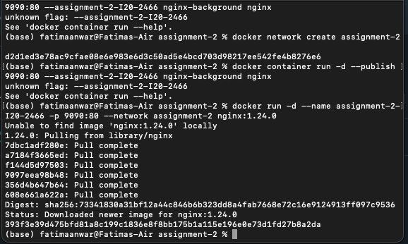

Q1:
Docker has a virtualised OS whereas VMs have a virtualised hardware.
Docker has burstable memory while VMs have static memory.
VMs have preinstalled libraries meanwhile in containers we need to install the libraries.

Q2:

