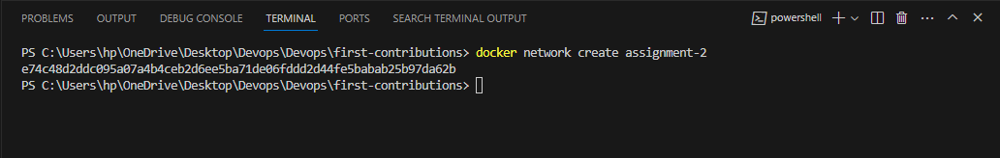
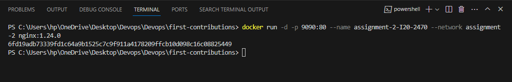

1-  Containers operate at the application layer, encapsulating an application and its dependencies, offering a lightweight and portable solution. In contrast, VMs are an abstraction of the physical hardware, simulating an entire operating system (OS) and hardware. Secondly, containers are characterized by static resource allocation, making them efficient for consistent workloads, while VMs excel in burstable memory scenarios, dynamically adjusting resources based on demand. Additionally, containers typically share the host OS's kernel, promoting efficiency and rapid deployment, whereas VMs encapsulate a complete OS, resulting in more substantial overhead but also enhanced isolation. 

2- docker run -d -p 9090:80 --name assignment-2-I20-2470 --network assignment-2 nginx:1.24.0

3- LOGS:

/docker-entrypoint.sh: /docker-entrypoint.d/ is not empty, will attempt to perform configuration
/docker-entrypoint.sh: Looking for shell scripts in /docker-entrypoint.d/
/docker-entrypoint.sh: Launching /docker-entrypoint.d/10-listen-on-ipv6-by-default.sh
10-listen-on-ipv6-by-default.sh: info: Getting the checksum of /etc/nginx/conf.d/default.conf
10-listen-on-ipv6-by-default.sh: info: Enabled listen on IPv6 in /etc/nginx/conf.d/default.conf
/docker-entrypoint.sh: Launching /docker-entrypoint.d/20-envsubst-on-templates.sh
/docker-entrypoint.sh: Launching /docker-entrypoint.d/30-tune-worker-processes.sh
/docker-entrypoint.sh: Configuration complete; ready for start up
2023/10/06 08:50:43 [notice] 1#1: using the "epoll" event method
2023/10/06 08:50:43 [notice] 1#1: nginx/1.24.0
2023/10/06 08:50:43 [notice] 1#1: built by gcc 10.2.1 20210110 (Debian 10.2.1-6)
2023/10/06 08:50:43 [notice] 1#1: OS: Linux 5.10.16.3-microsoft-standard-WSL2
2023/10/06 08:50:43 [notice] 1#1: getrlimit(RLIMIT_NOFILE): 1048576:1048576
2023/10/06 08:50:43 [notice] 1#1: start worker processes
2023/10/06 08:50:43 [notice] 1#1: start worker process 29
2023/10/06 08:50:43 [notice] 1#1: start worker process 30
2023/10/06 08:50:43 [notice] 1#1: start worker process 31
2023/10/06 08:50:43 [notice] 1#1: start worker process 32
2023/10/06 08:50:43 [notice] 1#1: start worker process 33
2023/10/06 08:50:43 [notice] 1#1: start worker process 34
2023/10/06 08:50:43 [notice] 1#1: start worker process 35
2023/10/06 08:50:43 [notice] 1#1: start worker process 36
