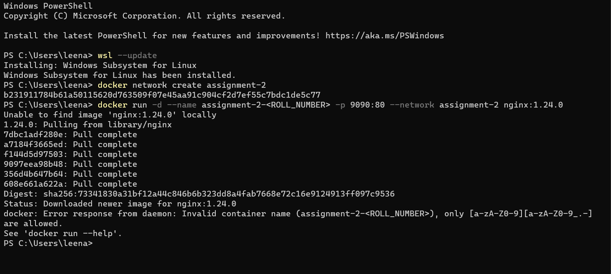

# Q1.

- VMS take a longer time to run compared to containers which are quicker to run
- VM uses a lot of system memory while containers use less system memory
- VMs are more secure as underlying hardware is not shared while it is containers hence not as secure
- VMs are the better choice when we require all of the OS resources while containers are useful when we are required to max the running apps using minimal servers.
- VMs are generally larger in size than containers

# Q2

docker network create assignment-2
docker run -d --name assignment-2-I202362 -p 9090:80 --network assignment-2 nginx:1.24.0

# Q3

