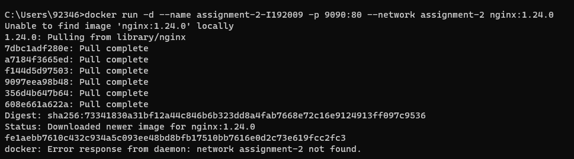

# Q1.

1. Containers typically have faster startup times compared to Virtual Machines (VMs), which can take longer to initialize.
2. VMs tend to consume a significant amount of system memory, whereas containers are more efficient in their memory usage.
3. VMs are considered more secure because they don't share underlying hardware resources, while containers, by design, share some resources and are therefore considered less secure in certain scenarios.
4. VMs are a preferable choice when you need to utilize the entirety of an operating system's resources, while containers excel at maximizing application density on minimal server resources.
5. VMs generally have larger disk space requirements compared to containers.

# Q2.

docker network create assignment-2

docker run -d --name assignment-2-I192009 -p 9090:80 --network assignment-2 nginx:1.24.0

# Q3.

I have run the above command and added screenshots above.

